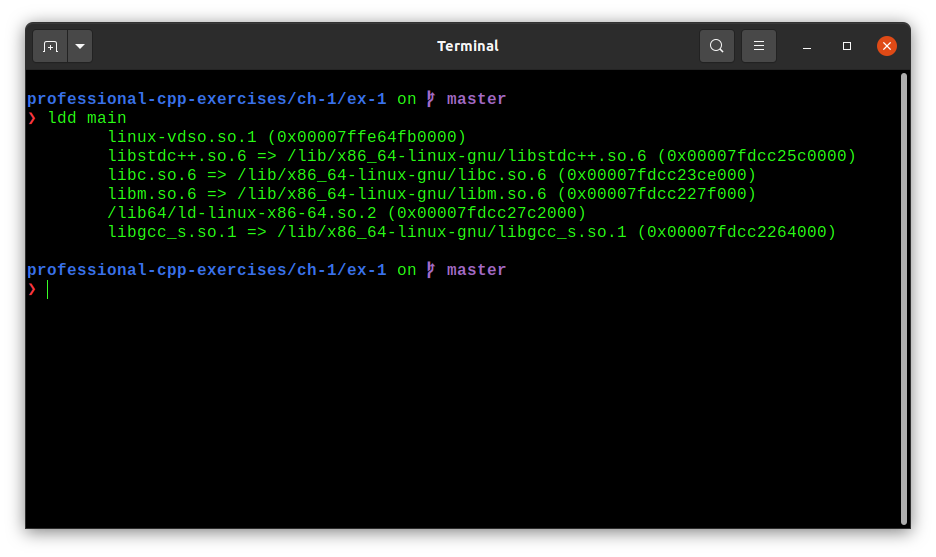

## Chapter 3: System Programming Concepts

On Linux, system call service routines follow a convention of returning a nonnegative value to indicate success. In case of an error, the routine returns a negative number, which is the negated value of one of the _errno_ constants. When a negative value is returned, the C library wrapper function negates it (to make it positive), copies the result into _errno_, and returns -1 as the function result of the wrapper to indicate an error to the calling program. 

Appendix A describes the _strace_ command, which can be used to trace the system calls made by a program, either for debugging purposes or simply to investigate what a program is doing.

There are different implementations of the standard C library on the various UNIX implementations. The most commonly used implementation on Linux is the GNU C library.

Sometimes, we need to determine the version of glibc on a system. From the shell, we can do this by running the glibc shared libary file as though it were an executable program. 

```
/lib/libc.so.6
```

On Ubuntu: ([source](https://stackoverflow.com/questions/54053087/libc-or-glibc-in-ubuntu))

Current Ubuntu uses glibc for the C standard library implementation. The source packages is called `glibc`, but the installed binary package is called `libc6` for historic reasons. You can see the exact version of the `libc6` package on your system if you run this command:

```
dpkg -l libc6
```

In some Linux distributions, the GNU C library resides at a pathname other than `/lib/libc6`. One way of determining the location of the library is to run the ldd (list dynamic dependencies) program against an executable linked dynamically against _glibc_ (most executables are linked in this manned). We can then inspect the resulting library dependency list to find the location of the _glibc_ shared library:

```
ldd myprog | grep libc
```



There are two means by which an application program can determine the version of the GNU C library present on the system: by testing constants or by calling a library function. glibc defines two constants, `__GLIBC__` and `__GLIBC_MINOR__`, that can be tested at compile time (in `#ifdef` statements). On a system with glibc 2.12, these called constants would have the values 2 and 12.

A common course of action after a failed system call is to print an error message based on the errno value. The perror() and strerror() library functions are provided for this purpose. 

The perror() function prints the string pointer to by its msg argument, followed by a message corresponding to the current value of errno. 

A simple way of handling errors from system calls would be as follows:

```c
fd = open(pathname, flags, mode);
if (fd == -1) {
    perror("open");
    exit(EXIT_FAILURE);
}
```

The strerror() function returns the error string corresponding to the error number given in its errnum argument.

The string returned by strerror() may be statically allocated, which means that it could be overwritten by subsequent calls to strerror().

Header file used by most example programs:

```c
#include <sys/types.h>  /* Type definitions used by many programs */
#include <stdio.h>      /* Standard IO functions */
#include <stdlib.h>     /* Prototypes of commonly used library functions,
                           plus EXIT_SUCCESS and EXIT_FAILURE constants */
#include <uninstd.h>    /* Prototypes for many system calls */
#include <errno.h>      /* Declares errno and defines error constants */
#include <string.h>     /* Commonly used string-handling functions */

```

