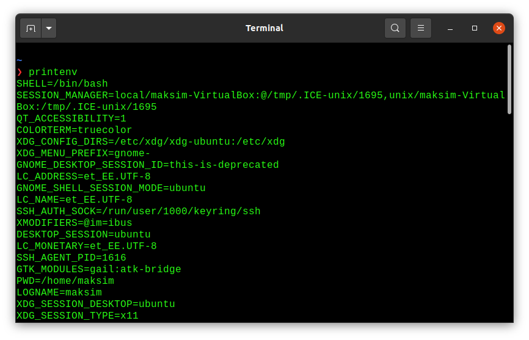

## Chapter 6: Processes

The parent of any process can be found by looking at the Ppid field provided by the Linux-specific /proc/PID/status file.

A virtual memory scheme splits the memory used by each program into small, fixed-size units called pages. Correspondingly, RAM is divided into a series of page frames of the same size. An any one time, only some of the pages need to resident in physical memory page frames; these pages form the so-called resident set. Copies of the unused pages of a program are maintained in the swap area—a reserved area of disk space used to supplement the computer's RAM—and loaded into physical memory only as required. When a process references a page that is not currently resident in physical memory, a page fault occurs, at which point the kernel suspends execution of the process while the page is loaded from disk into memory. 

Each process has an associated array of strings called the environment list, or simply the environment. Each of these strings is a definition of the form name=value. Thus, the environment represents a set of name-value pairs that can be used to hold arbitrary information. The names in the list are referred to as environment variables.

```
SHELL = /bin/bash   // create a shell variable
export SHELL        // Put variable into shell process's environment
```

In bash, this can be abbreviated to:

```
export SHELL=/bin/bash
```

The `printenv` command displays the current environment list.



The environment list of any process can be examined via the Linux-specific `/proc/PID/environ` file, with each NAME=value pair being terminated by a null byte.

Within a C program, the environment list can be accessed using the global variable char **environ. (The C run-time startup code defines this variable and assigns the location of the environment list to it.)

